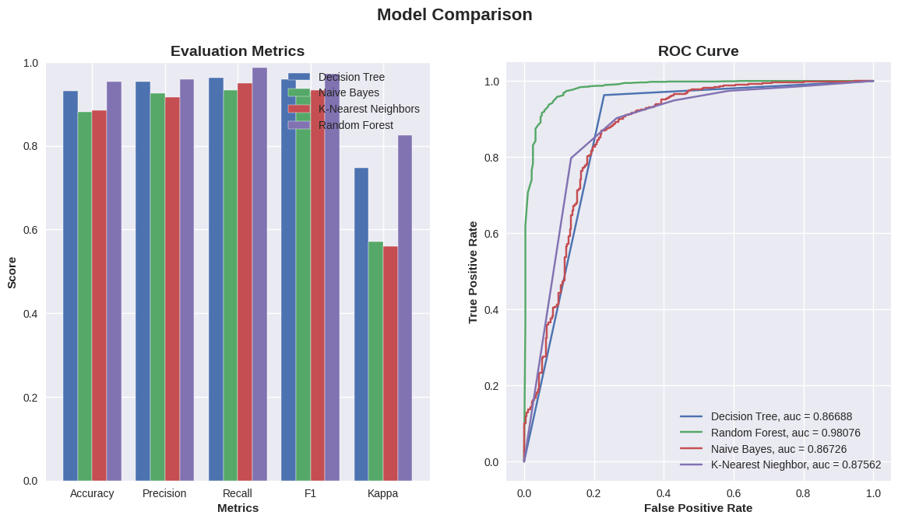
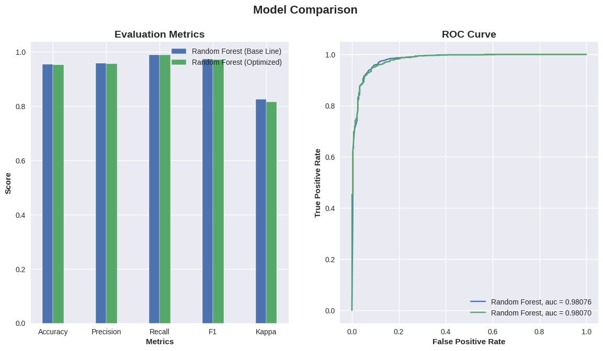

# Data Challenge
This repo contains my solution to JOBBarcelona '23 data science challenge ([link](https://nuwe.io/dev/competitions/job-barcelona-23/jobarcelona-23-data-science)).
**Note for challenge reviewers**: I know I edited repo after challenge's ending, it was just the readme for the future me :) (don't take it as doc)

## Challenge description

We are a bank and we have some data about our costumers, the goal is to determine wether a client's account will be stable in a long term or it will close imminently.
We do have the [supply_chain_train.csv](./supply_chain_train.csv) file which contains data about costumers and what was the output of its account and the [supply_chain_test.csv](./supply_chain_test.csv) file which will be the one with the data that we will have to get the [predictions.json](./predictions.json) file.

## Proposed solution

This is my first time doing and so I had to learn about how to do it, I knew this was a problem about classification and that I could solve it using a model build with python. The models I tryed were DTC (Decision Tree), RF (Random Forest), NB (Naive Bayes) and KNN (K-Nearest Neighbours) ([link to some doc](https://towardsdatascience.com/k-nearest-neighbors-naive-bayes-and-decision-tree-in-10-minutes-f8620b25e89b)):

In the [DataChallenge.ipynb](./DataChallenge.ipynb) file you will find the source code together with some explanations and in-code comments.

### Results:

After looking at the plot of the resulting model's scores I opted for using the RF to get the solution.

### Optimitzation:

I also tried to optimize the f1-score that the RF was giving with [GridSearchCV](https://www.mygreatlearning.com/blog/gridsearchcv/), but unluckily the results weren't better :(

The [predictions.json](./predictions.json) file was the submited one and gave a **0.9** score which for what I [read](https://stephenallwright.com/good-f1-score/) looks like is not that bad xd
